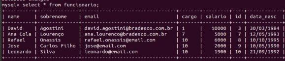
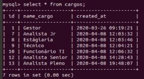
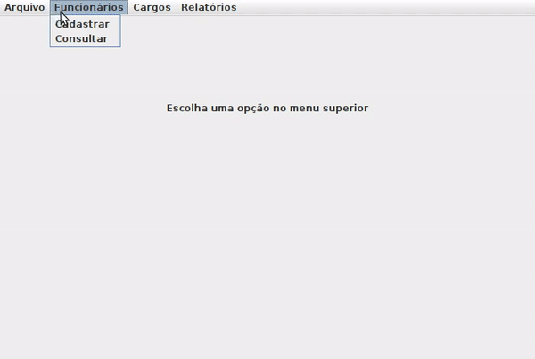

 # Sistema Funcionários - Java

## Índice

* [1. Sobre o projeto](#1-sobre-o-projeto)
* [2. Funcionalidades da aplicação](#2-funcionalidades-da-aplicação)
* [3. Uso](#3-uso)
* [4. Visualização](#4-visualização)
* [5. Ferramentas Utilizadas](#5-ferramentas-utilizadas)

***

## 1. Sobre o projeto

Este projeto foi desenvolvido em Java, usando Swing e JavaFX para criação dos componentes visuais, com a biblioteca JFreeChart para realizar a parte visual de gráficos e MySQL como gerenciador de banco de dados. Sistema para empresa realizar o controle de funcionários e cargos que a mesma possui. Com funções de "Incluir/Excluir/Alterar/Consultar de Funcionários/Cargos" conseguindo também gerar relatórios sobre esses dados.

## 2. Funcionalidades da aplicação

As funcionalidades disponibilizadas ao usuário são:

* Cadastro de Cargo;
* Consulta, edição e exclusão de cargos;
* Cadastro de Funcionários;
* Consulta, edição e exclusão de funcionários;
* Apresentaçáo de relatórios de cargos e salários.

Ao desenvolver cada funcionalidade, foram desenvolvidos critérios que deveriam ser cumpridos para atender a _definição de pronto_.

## 3. Uso

Para visualização dessa aplicação, você deverá ter instalado os seguintes recursos:

* Java
* MySQL
* Eclipse (IDE)

* Passo 1_ Após ter instalado esses 3 recursos, você precisa baixar esse projeto e abrir no Eclipse.
* Passo 2_ Conectar o MySQL com seu projeto na IDE Eclipse.
* Passo 3_ Rodar a aplicação. E utliza-lá para criar seu banco de dados de funcionários e cargos.

Para conectar o seu Banco de Dados com o projeto, você deverá alterar o arquivo *br.com.ConexaoBanco.java*, que se encontra na pasta src/sistema/br.com.ConexaoBanco, e inserir sua *servidor*, *usuário* e *senha*.

### Banco de Dados

O banco de dados deverá ter o nome de *sistema_de_funcionarios*

A tabela FUNCIONÁRIO deverá se chamar *funcionario* e deverá ser criada com as definições do exemplo abaixo.

A tabela CARGOS deverá se chamar *cargos* e deverá ser criada com as definições do exemplo abaixo.

## 4. Visualização

Aqui você pode visualizar como o projeto funciona.

## 5. Ferramentas utilizadas

Para desenvolver essa aplicação, utilizei as seguintes ferramentas:

* Java
* Swing
* JavaFx
* JFreeChart
* MySQL
* Eclipse
* GIT
* GitHub
